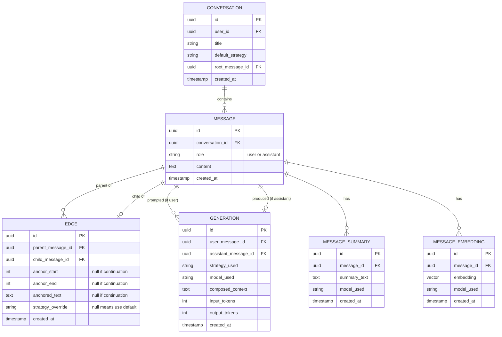

#  Data Model Decision Record

This document captures every data-model decision made so far in Phase 2. The conceptual model is locked. Field types, nullability rules, indexing strategy, and database choice are still open and are the subject of the next conversations.

Same rule as Phase 1: re-read this document before changing scope. Reopening a locked decision requires writing a new record that supersedes the relevant section, not a casual pivot.

---

## 1. The atom: Message, not Turn

A user prompt and an AI response are stored as **separate Message rows**, not fused into a single "turn." Each Message has a `role` field with value `user` or `assistant`. The "chat window" the user sees is a path through the message graph — a _view_, not a stored entity.

### Why not turn-as-node

- **Evaluation framework.** The harness runs the same user message under five strategies and compares the five AI responses. Turn-as-node would force duplicating the user message five times to compare strategies.
- **Streaming lifecycle.** User messages are committed instantly. AI messages stream over seconds. Fusing them means the "atom" is actually a two-phase write pretending to be one row.
- **Span anchors.** Branches anchor into AI responses, not into user prompts. Turn-as-node hides that — offsets would implicitly mean "into the AI half."
- **Regeneration.** Producing a new AI response for the same prompt is a new row with message-as-node. With turn-as-node, regeneration mutates half an atom.

---

## 2. Edge as its own entity (Option C)

The parent-child relationship between messages lives in its own **Edge** table, not as columns on Message. Every Message has zero or one incoming Edge (its parent). A Message can have many outgoing Edges (its children).

Edge carries:

- `parent_message_id`, `child_message_id`
- Anchor fields: `anchor_start`, `anchor_end`, `anchored_text` — all nullable
- `strategy_override` — nullable

### Why a separate table, not columns on Message

- The relationship has its own lifecycle, separate from either endpoint. An anchor can break (e.g., the parent's text changes), repair attempts can fail, the edge can enter an "orphaned" state — none of that is a property of either message.
- Future fields about the connection (repair history, anchor confidence score, orphan flag) go cleanly on Edge instead of being piled onto Message.

### Branch vs continuation = anchor populated or null

There is **no explicit type column** on Edge. The rule is:

- Anchor fields populated → this Edge represents a **branch**.
- Anchor fields null → this Edge represents a **continuation**.

The schema enforces the distinction. No discriminator needed.

---

## 3. Anchors store text and offsets together

Both `anchor_start`/`anchor_end` and `anchored_text` are stored. Each does a different job:

- **Offsets** are the fast path. On every render of the parent message, the UI needs to know where to draw the branch indicator (underline, hover affordance). With offsets, that's a direct lookup. Without, it's a substring search per branch per render.
- **Offsets disambiguate.** When the anchored text appears multiple times in the parent ("vector embedding" appearing twice), offsets identify which occurrence was selected.
- **Anchored text is the repair mechanism.** When the parent's content changes, offsets become unreliable. Fuzzy-matching the stored `anchored_text` against the new content locates where the anchor moved to. Found → update offsets. Not found → the Edge enters an orphaned state, UI flags it, user can re-anchor or leave it broken.

This is the alternative to "silently degrade the branch to attach to the whole new response," which would erode the differentiator with every edit.

### Anchor repair is only needed for edits

The other things that "change" a message don't actually change canonical content:

- **Regeneration** produces a new sibling assistant Message; the old one's content is untouched, anchors pointing to it still work.
- **Summarization** stores a derived representation in MessageSummary; the canonical Message row is untouched.

So edits are the only mutation anchor repair has to handle. The rest of the model protects canonical content from mutation.

---

## 4. Generation: the record of producing an AI message

**Generation** is a separate entity. Every time an AI response is produced, a Generation row is written. It carries:

- `user_message_id` — which user message it answered
- `assistant_message_id` — which AI message it produced
- `strategy_used` — the strategy that actually ran (historical record)
- `model_used`, model parameters
- `composed_context` — the full context that was sent to the LLM
- `input_tokens`, `output_tokens`

### Why a separate entity

- **Eval framework.** Running the same user message under five strategies = five Generations pointing at the same user message, each producing a different assistant message. No duplication of canonical content. (See scenario 3 below.)
- **Regeneration.** Each click of "regenerate" is a new Generation + new assistant Message. The old assistant Message stays in the database.
- **Reproducibility.** `composed_context` lets you reconstruct exactly what was sent to the LLM for any past response — critical for the eval report and for debugging strategy bugs.

---

## 5. Regeneration never deletes

When the user regenerates an AI response, the system creates a new Generation and a new assistant Message. **The old Message is not deleted.**

### Why

A user may have branched off a span inside the old AI response. Those branches contain real user work. Deleting the old response would orphan or destroy that work.

### Trade-off accepted

Storage grows with every regeneration. That's fine — storage is cheap, user trust is not. A user message ends up with multiple assistant Message children, one per Generation. The UI shows the most recent as "current"; the others are still there and still navigable. Branches anchored to old versions of the response keep working because the old version still exists with its content unchanged.

---

## 6. Summaries and embeddings: separate tables, FK on the derived side

**MessageSummary** and **MessageEmbedding** are their own tables, each with `message_id` as a foreign key pointing back to Message. Both carry `model_used` and `created_at` so model swaps don't require schema migrations.

**Direction of the FK matters.** It lives on the derived table, not on Message. Message has no `summary_id` or `embedding_id` column. This is what makes "one message → many summaries" and "one message → many embeddings" possible. A single Message can have multiple summaries (different models, different lengths) and multiple embeddings (different embedding models). Selection logic at query time picks the right one.

### Why not Option 1 (fields directly on Message)

- Summaries and embeddings have **different lifecycles** from canonical content. Content is written once and immutable. Derived artifacts can be recomputed when models change.
- Mixing immutable and mutable columns on one row creates write contention and migration pain.
- No way to keep multiple summaries (e.g., short vs long) on a single Message row without ugly column proliferation.

### Why not Option 3 (generic derived-artifact table)

- Loss of type safety. Summaries are text. Embeddings are vectors. A single `content` column can't be both.
- The flexibility isn't worth losing schema-level enforcement.

### Open question (noted for later)

When multiple summaries exist for the same message, which one does the context-composition logic use? Likely "most recent for the currently-active model." Don't solve now; the `model_used` and `created_at` columns leave room to write the selection rule in code without schema changes.

---

## 7. Asynchronous summarization, lightweight infrastructure for MVP

Summaries are generated **asynchronously in the background** after a message is created. Not eagerly (wasteful — most messages never end up beyond depth N in any branch). Not lazily on user-facing requests (adds latency the product can't afford).

### Infrastructure for MVP

Recommended: **FastAPI BackgroundTasks** or **arq** (lightweight asyncio job queue on Redis), not Celery.

Reasoning:

- Summarization is not latency-critical. The background job has plenty of time before anyone needs the summary in a deep branch.
- Failures are tolerable — worst case, regenerate on next attempt.
- Throughput is tiny: one summarization per assistant message.
- Celery's industrial-strength features (priorities, complex routing, multi-broker support) solve problems we don't have yet.

Upgrade path to Celery stays open if real load justifies it later.

---

## 8. Context composition latency: 1–2 seconds, with graceful degradation

The target latency budget for the entire context-composition step (before the LLM call begins streaming) is **1–2 seconds end-to-end**. Not 10 seconds. A 10-second pre-LLM delay makes the product feel broken regardless of answer quality.

Budget breakdown:

- Embed the user's current query: ~200ms
- Score ancestor embeddings vs query embedding: ~10ms (in-memory) or longer (vector DB)
- Walk and assemble context: negligible

### Failure modes get deliberate fallbacks, not silence

Each step has a defined graceful-degradation path:

- Embedding service down → fall back to `HierarchicalDecay` without retrieval drill-down for this request.
- Summary not yet generated → use full text for that ancestor (more expensive, still correct).
- Ancestor chain unusually deep → cap the walk at a depth limit, accept truncation.

The full failure-mode list is a TODO for the implementation phase. The principle is locked: graceful degradation, not silent failure.

---

## 9. SpanOnly added — five strategies total

Phase 1 originally specified four strategies. During Phase 2 we identified a fifth, **SpanOnly**, which sees only the anchored span (no ancestor chain at all). Many span-anchored branches are definitional or syntax-explanation questions where ancestor context actively hurts quality.

Full strategy list:

1. `FullInheritance`
2. `ParentOnly`
3. `SpanOnly` _(new — added per amendment in Phase 1 decision record dated 2026-05-18)_
4. `HierarchicalDecay`
5. `HierarchicalDecayWithRetrieval`

### Constraint

SpanOnly is **only valid on branches**. It has no meaning for continuations (no span exists). The schema enforces this — SpanOnly cannot appear as `Conversation.default_strategy`.

---

## 10. Strategy lives in three places, meaning three different things

|Field|Where it lives|What it means|
|---|---|---|
|`default_strategy`|Conversation|The user's choice for the whole conversation, set at creation. Excludes SpanOnly.|
|`strategy_override`|Edge|Populated only when a branch overrides the conversation default. Null on continuations. Null on branches that accept the default. (Option Y.)|
|`strategy_used`|Generation|Historical record of which strategy actually ran when this AI response was produced.|

### Rules

- Continuations always inherit the "active strategy" by walking up (see resolution rule below).
- Branches default to **SpanOnly** at creation but the user may override to any of the five.
- `Conversation.default_strategy + Edge.strategy_override` together = **intent** (what to do next).
- `Generation.strategy_used` = **history** (what was done).
- These are not expected to stay in sync. They serve different purposes.

### Strategy resolution: walk up until you find an override

For any Message, the active strategy is found by walking up the Edge chain. Take the parent Edge of the message. If its `strategy_override` is non-null, use it. Otherwise walk to the parent Edge of _that_ Edge's parent message, and repeat. If you reach the root without finding an override, fall back to `Conversation.default_strategy`.

Most-specific override wins. The walk stops at the first hit.

Worked example. Conversation default is `HierarchicalDecay`. User branches with `strategy_override = SpanOnly`. User continues inside that branch:

```
[Continuation Edge]   strategy_override = NULL   ← newest
[Continuation Edge]   strategy_override = NULL
[Branch Edge]         strategy_override = SpanOnly   ← hit, stop here
[older edges...]
                      ↓
Conversation.default_strategy = HierarchicalDecay   (never reached)
```

The continuation inherits SpanOnly because the branch above it overrode the conversation default. This is what users expect: branches declare their own intent, and continuations inside the branch respect that intent until another branch overrides.

Implication: nested branches use most-specific. A branch inside a branch with its own `strategy_override` governs its own subtree, invisible to its sibling subtree.

### Why Option Y (nullable override) and not Option X (every Edge has a strategy column)

If the user changes the conversation's default strategy in week 3, continuations created before then should pick up the new default automatically — they don't have a stored override to fight with. Option X would have frozen the old strategy into every old continuation. Option Y matches the rule we actually described.

---

## 11. Conversation is the top-level container

Every Message belongs to exactly one **Conversation**. The Conversation owns:

- `user_id` (ownership / access control)
- `title`
- `default_strategy`
- `root_message_id` (the root of the message DAG)
- `created_at`, `updated_at`

A Conversation is what the user clicks in their sidebar. A "window" (the linear thread shown in the UI for a selected leaf node) is **not stored** — it is computed at render time by walking from the leaf through parent Edges to the root.

This is the legitimate version of the `window_id` idea that was rejected earlier in this conversation. A Conversation is a thing; a window is a view.

**Branching does not create a new Conversation.** Branches live inside the same Conversation as their parent. The whole DAG, including all its branches, is one Conversation.

---

## 12. Entity-relationship summary



---

## 13. Validation: scenarios the model handles

These four scenarios were walked through to stress-test the model. The key insights from each:

**Scenario 1 — Continuation (follow-up message in same conversation).** Inserts: one user Message, one continuation Edge, one assistant Message, one continuation Edge, one Generation. Async: queue summary + embedding for the assistant Message. Anchor fields all NULL on both edges. Active strategy resolved by walk-up.

**Scenario 2 — Branch creation.** Inserts: one user Message (content = user's typed question), one branch Edge (anchor_start/end populated, anchored_text = substring from parent, strategy_override = SpanOnly by default), one assistant Message, one continuation Edge from user to assistant, one Generation. Note the asymmetry: the span text lives in `Edge.anchored_text`, not in `Message.content`.

**Scenario 3 — Eval harness, five strategies on one user message.**

- New user Messages: **0** (existing one is reused — this is the whole point of Generation as a separate entity)
- New assistant Messages: **5**
- New Generations: **5** (each pointing at the same `user_message_id`, each with a different `assistant_message_id` and `strategy_used`)
- New Edges: **5** (continuation edges connecting the existing user Message to each new assistant Message)

The asymmetry — input fixed, output multiplies — is what Generation was designed to enable.

**Scenario 4 — Regeneration of an AI response with existing branches.**

- Old assistant Message stays. Its content is unchanged.
- New assistant Message is inserted with a new continuation Edge from the same user Message.
- New Generation row is inserted.
- The two existing BranchEdges anchored to spans inside the old assistant Message **still point at the old Message**. They keep working because the old Message wasn't deleted and its content wasn't mutated.

The "regeneration never deletes" rule earns its keep here.

---

## 14. What's locked

Do not reopen without writing a superseding record.

- Message is the atom. Role field distinguishes user from assistant.
- Edge is a separate table. Anchor fields populated → branch. Null → continuation.
- Anchors store offsets _and_ text. Offsets are the fast path; text is the repair mechanism.
- Generation is a separate entity. Each AI response has one. Each user message can have many.
- Regeneration creates new rows. The old assistant Message is never deleted.
- MessageSummary and MessageEmbedding are separate tables, each carrying `model_used` and `created_at`. FK lives on the derived table, not on Message.
- Summarization is asynchronous. BackgroundTasks or arq for MVP. Celery only if load demands it.
- Context composition target latency: 1–2 seconds end-to-end.
- Failure modes get deliberate fallbacks, not silent failure.
- Five strategies. SpanOnly only valid on branches.
- Strategy lives in three places (Conversation default, Edge override, Generation history) with three different meanings.
- Strategy resolution walks up the Edge chain; first non-null override wins; Conversation default is the fallback.
- Conversation is the top-level container. Windows are not stored. Branches live inside the same Conversation.

---

## 15. What's open (next Phase 2 conversations)

- **Field-level schema:** exact types, nullability, defaults, constraints, check constraints (e.g., either all anchor fields are populated or all are null), unique constraints.
- **Indexing strategy:** primarily for ancestor walks (used for both context composition and strategy resolution). Naive recursive CTE may suffice for MVP depths; closure table or path enumeration are tools in the box if it gets slow.
- **Database choice:** strong candidates are Postgres (with pgvector for embeddings) versus a hybrid setup (Postgres for relational + dedicated vector store). Decide based on operational complexity, embedding-index performance, and how much you want one system vs many.
- **"Current summary" selection logic:** when multiple summaries exist for the same message, which one does context-composition use? Defer until selection actually matters.
- **Full failure-mode list:** every step in context-composition + its specific fallback. Belongs near the implementation of the strategy interface.
- **Regeneration UX:** how the UI surfaces multiple Generations of the same user message. (Product question more than data question — the data model supports any reasonable answer.)
- **LLM provider abstraction:** carried forward from Phase 1 open questions. Not specific to data model but touches Generation.
- **Auth:** carried forward from Phase 1. Affects `user_id` on Conversation.

---

## End of Phase 2 data model section

Next conversation: field-level schema and database choice. The two are linked — you can't fully specify a `vector` column without committing to pgvector or an alternative. Come into that conversation with a position on Postgres+pgvector vs Postgres+separate-vector-store, framed by operational complexity for a solo developer working 8–10 hours per week.